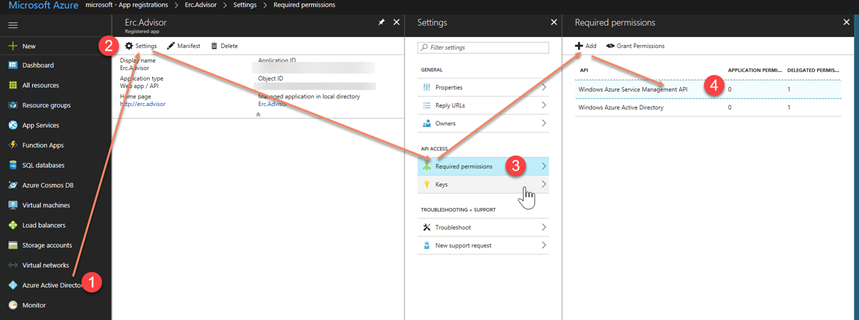
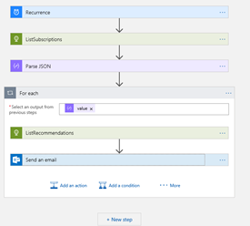

# Azure Advisor has an API!

Microsoft announced the preview of the Azure Advisor in November 2016, [https://azure.microsoft.com/en-us/blog/announcing-public-preview-azure-advisor/](https://azure.microsoft.com/en-us/blog/announcing-public-preview-azure-advisor/) 

But did you know there is also an API? [https://docs.microsoft.com/en-us/rest/api/advisor/](https://docs.microsoft.com/en-us/rest/api/advisor/)

This is a short sample that gets the result of the advisor recommendations and sends an email with the results every day.

Here is how to build this:

1. Create an Azure AD application, you can use [portal](https://docs.microsoft.com/en-us/azure/azure-resource-manager/resource-group-create-service-principal-portal) or [PowerShell](https://docs.microsoft.com/en-us/azure/azure-resource-manager/resource-group-authenticate-service-principal), or [CLI](https://docs.microsoft.com/en-us/cli/azure/create-an-azure-service-principal-azure-cli?toc=%2Fazure%2Fazure-resource-manager%2Ftoc.json&view=azure-cli-latest)

2. Add "Azure Service Management API" permissions to the app

 

3. Create a "Logic App" on the portal and paste in the included code into the code view, and replace the values with the values you copied while creating the AD application. The designer view should look something like the following:

    

4. Start receiving emails...
